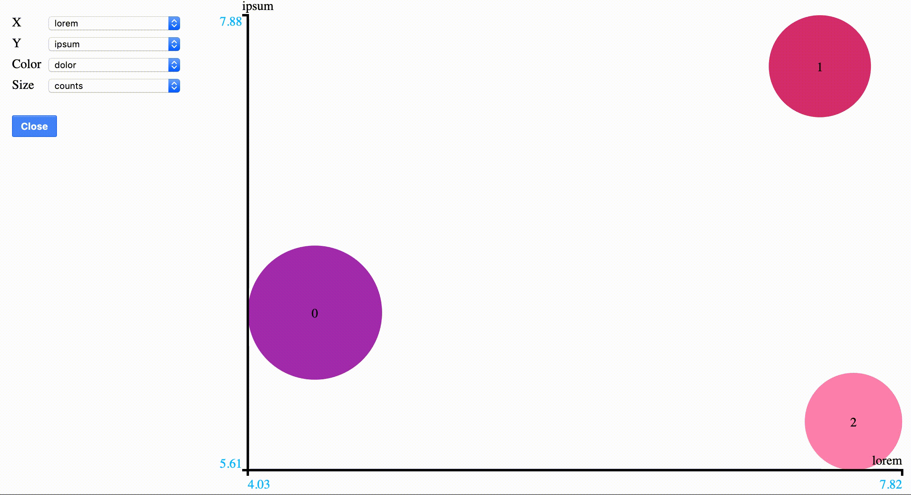

# Build an online clustering and visualization app in less than 120 lines of code 
> Tutorial

# Introduction
In this tutorial, we will see how to integrate two libraries :
[distclus4py](https://github.com/wearelumenai/distclus4py)
and
[bubbles4py](https://github.com/wearelumenai/bubbles4py)
in order to modelize a data flow online.

# requirements
This demo needs Python 3.7 to run. It is recommended to use a virtualenv.

# Build ans install the components
First you need to properly install the two libraries :
 - [distclus4py](https://github.com/wearelumenai/distclus4py)
 - [bubbles4py](https://github.com/wearelumenai/bubbles4py)

**_Note_** : follow carefully the instruction given in the README of these
libraries.

Then download this demo and continue as follows to install the libraries :

```
$ cd flowclust
$ python3.7 -m venv ./venv
$ . ./venv/bin/activate
(venv) $ pip install Cython numpy scipy # because POT is flawed
(venv) $ python setup.py install
(venv) $ pip install <path/to/disclus4py>
(venv) $ pip install <path/to/bubbles4py>
```

# Run the demo

First run a simulation server that deliver a dataflow :

```
$ python -m flowsim &
```

Now you should be able to get data points :

```
$ curl -XGET 'http://localhost:8080/points?start=2019-06-26T15:39&stop=2019-06-26T15:40'
```

If every thing goes well, start the clustering and visualization service :

```
$ python -m oc
```

Now visit this page to see the live results :
http://localhost:8081/bubbles?result_id=batch_tutorial

Which will display something like :


# How it works

## Result transitions

Clusters are appearing, disappearing and reappearing as the dataflow is
processed.

We need to be able to detect which cluster has appeared or disappeared.
Then we need to associate current clusters to previously known clusters
in order to show proper transitions,
we have done this using optimal transport
(refer to https://pot.readthedocs.io/en/stable/#).

Each time a new clustering result is issued, it is compared to the known
clusters.
 - If both results have the same number of clusters,
   OT is used to associate them.
 - If the results does not have the same number of clusters,
   the farthest clusters of the longest result are excluded in order
   to keep the same number of clusters in both results,
   then OT is used to associate them. <br>
   The other clusters have appeared or disappeared depending on the result
   which was the longest (current or known).
   
This is implemented in the `assembly` package by the `Assembly` class :
 - method `coalesce` takes the current result and returns labels corresponding
 to the best known clusters.
 - attribute `points` gives all known clusters.
 
 ## Result construction
 
 The dataflow delivers data thanks to its REST API. Data are formatted like
 this :
 ```
{
    'ts': [...],
    'points': [[...], [...], ...],
    'columns': ['lorem', 'ipsum', 'dolor']
}
```
where:
 - `ts`: gives point timestamps (we don't use them)
 - `points`: the points matrix (each point has 3 dimensions)
 - `columns`: dimension names (columns of the `points matrix)
 
The data processed by an instance of the `OC` class in the `oc.py` module
 of the `oc` package :
 - method `push_predict` takes data from the dataflow and use a mini-batch
 algorithm to evolve the clustering result
 (refer to
 [distclus4py README.md](https://github.com/wearelumenai/distclus4py)).
 Then it uses an `Assembly` to map the current result to known clusters
 and compute size of each clusters (some old known clusters may be empty).
 Eventually it returns a result that can be used by the dataviz server.
 
## Result serving

The dataviz server is set up and started by the `start_server`
method in the `server.py` module of the `oc` package. It takes the following
optional parameters :
 - `host`: the host that the server listens for
 - `port`: the port that the server listens on
 - `result_id`: the identifier used to store and get the results
 It returns a `SingletonDriver` used to store the results (refer to
 [bubbles4py README.md](https://github.com/wearelumenai/bubbles4py)).

Once started, the server is fed by `run` method in the `server.py` module
of the `oc` package. It takes the following parameters :
 - `model`: the `OC` instance responsible for cluster computing
 - `get_chunk`: a function that returns points between 2 instants
 - `driver`: an instance of `SingletonDriver` returned by `start_server`
 - `every`: polling time between data flow query
The `run` method push new chunks of data into the `OC` model and send 
clustering to the dataviz server. It delegates data flow polling to the
`get_data` function.

The `get_chunk` function is declared in the `data.py` module of the `oc`
package. For the demo, it is actually defined in the `client.py` module
of the `flowsim` package. 

# Reusable components and customization

The following components may be reused for any data flow.

package    | module       | component      | type       | description
---------- | ------------ | -------------- | ---------- | -----------
`assembly` | `ass.py`     | `Assembly`     | class      | coalesces and maps new and historical results with OT
`oc`       | `oc.py`      | `OC`           | class      | process mini batches from the data flow and build clustering results
`oc`       | `server.py`  | `start_server` | function   | start the dataviz server
`oc`       | `server.py`  | `run`          | function   | feed the server with clustering result computed from the data flow
`oc`       | `server.py`  | `get_data`     | function   | poll the data flow
 
 
 The following components must be customized for each data flow.

package    | module       | component      | type       | description
---------- | ------------ | -------------- | ---------- | -----------
`oc`       | `data.py`    | `get_chunk`    | function   | get a chunk of data flow
 
# Conclusion

At time of writing, the `assembly` module contains less than 45 lines of code and the
`oc` module contains less than 75 lines of code (commentaries are excluded).
 - this is enough to build an online clustering and dataviz application
 - most of it is reusable !
 

